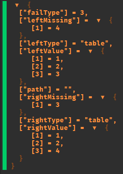

<h1 align="center">
deep-equal
</h1>

> Recursive comparator for ROBLOX projects.

<p align="left">
<a alt="Released version" href="https://www.npmjs.com/package/@rbxts/deep-equal">
</a>

<a alt="Last commit date" href="https://github.com/daymxn/rbxts-deep-equal/commits/main/">
</a>
<a alt="Open issues" href="https://github.com/daymxn/rbxts-deep-equal/issues">
</a>

<a alt="License" href="https://github.com/daymxn/rbxts-deep-equal/blob/main/LICENSE">
</a>
</p>

---

<br>

## Demo

```ts
import { deepEqual } from "@rbxts/deep-equal";

const result = deepEqual([1,2,3], [1,2,4]);
warn(result);
```



## Installation

Install `deep-equal` with your preferred package manager.

### npm

```sh
npm install @rbxts/deep-equal
```

### pnpm

```sh
pnpm add @rbxts/deep-equal
```

### yarn

```sh
yarn add @rbxts/deep-equal
```

## Overview

**deep-equal** is an implementation of the common recrusive comparator, but for roblox projects.

Since roblox `tables` are typically compared by reference, utilizing **deep-equal** allows you
to compare them by nested values, and get _specific_ failure data on where the comparison failed.

**deep-equal** is also able to differentiate between arrays and non-array tables, so your
comparisons on two arrays can be more array specific.

> [!NOTE]
> **deep-equal** is built to primarily be used as an implementor of deep equal
> algorithms for _other_ assertion libraries, or more complex validation systems.
>
> That's why failures return an object of _specific_ failure data, instead of throwing
> an error.

## Usage

### Basic Usage

#### Common Types

##### Strings

```ts
deepEqual("daymon", "michael");
/**
 * {
 *   failType: FailureType.DIFFERENT_VALUES,
 *   leftValue: "daymon",
 *   rightValue: "michael"
 * }
 */
```

##### Numbers

```ts
deepEqual(5, 10);
/**
 * {
 *   failType: FailureType.DIFFERENT_VALUES,
 *   leftValue: 5,
 *   rightValue: 10
 * }
 */
```

##### Booleans

```ts
deepEqual(true, false);
/**
 * {
 *   failType: FailureType.DIFFERENT_VALUES,
 *   leftValue: true,
 *   rightValue: false
 * }
 */
```

##### Different Types

```ts
deepEqual(5, "5");
/**
 * {
 *   failType: FailureType.DIFFERENT_TYPES,
 *   leftValue: 5,
 *   leftType: "number",
 *   rightValue: "5",
 *   rightType: "string"
 * }
 */
```

#### Arrays

```ts
deepEqual([1,2,3], [1,2,4]);
/**
 * {
 *   failType: FailureType.MISSING_ARRAY_VALUE,
 *   leftValue: [1,2,3],
 *   rightValue: [1,2,4],
 *   leftMissing: [4],
 *   rightMissing: [3]
 * }
 */
```

#### Tables

##### Different Property Values

```ts
deepEqual({
  name: "daymon",
  age: 100
}, {
  name: "daymon",
  age: 200
});
/**
 * {
 *   failType: FailureType.DIFFERENT_VALUES,
 *   leftValue: 100,
 *   rightValue: 200,
 *   path: "age"
 * }
 */
```

##### Missing Array Values

```ts
deepEqual({
  name: "daymon",
  cars: ["Tesla", "Civic"]
}, {
  name: "daymon",
  cars: ["Tesla"]
});
/**
 * {
 *   failType: FailureType.MISSING_ARRAY_VALUE,
 *   leftValue: ["Tesla", "Civic"],
 *   rightValue: ["Tesla"],
 *   rightMissing: ["Civic"],
 *   path: "cars"
 * }
 */
```

##### Missing Properties

```ts
deepEqual({
  name: "daymon",
  age: 100
}, {
  name: "daymon",
});
/**
 * {
 *   failType: FailureType.MISSING,
 *   leftValue: 100,
 *   rightValue: undefined,
 *   path: "age"
 * }
 */
```

##### Nested Tables

```ts
deepEqual({
  name: "daymon",
  details: {
    origin: {
      city: "Kansas City",
      state: "MO"
    }
  }
}, {
  name: "daymon",
  details: {
    origin: {
      city: "Kansas City",
      state: "KS"
    }
  }
});
/**
 * {
 *   failType: FailureType.DIFFERENT_VALUES,
 *   leftValue: "MO",
 *   rightValue: "KS",
 *   path: "details.origin.state"
 * }
 */
```

#### Roblox Types

Roblox types can be split into two categories: ones that are compared by _value_
and ones that are compared by _reference_.

##### Value Types

```ts
deepEqual(new Vector3(1,2,3), new Vector3(1,2,3)); // pass

deepEqual(new Vector3(1,2,3), new Vector3(2,4,6));
/**
 * {
 *   failType: FailureType.DIFFERENT_VALUES,
 *   leftValue: (1, 2, 3),
 *   rightValue: (2, 4, 6)
 * }
 */
```

##### Reference Types

> [!TIP]
> You can provide [custom comparators](#custom-comparators) for comparing reference types.

```ts
deepEqual(new OverlapParams(), new OverlapParams());
/**
 * {
 *   failType: FailureType.DIFFERENT_REFERENCE,
 *   leftValue: "OverlapParams{...}",
 *   rightValue: "OverlapParams{...}"
 * }
 */
```

### Configuration

You can optionally provide some configuration in your
calls to **deep-equal**, or set them at the [global level](#setting-global-configuration).

#### Ignoring Types

An array of types to ignore.

```ts
deepEqual({
  name: "daymon",
  position: new Vector3(1,2,3),
  cars: ["Tesla", "Civic"]
}, {
  name: "daymon",
  position: new Vector3(2,4,6),
  cars: ["Tesla"]
}, { ignore: ["Vector3"] });
/**
 * {
 *   failType: FailureType.MISSING_ARRAY_VALUE,
 *   leftValue: ["Tesla", "Civic"],
 *   rightValue: ["Tesla"],
 *   rightMissing: ["Civic"],
 *   path: "cars"
 * }
 */
```

When the `left` or `right` is any of these types,
it will be skipped; effectively "ignoring" it for the
purposes of checking if two objects are equal.

#### Reference Only

An array of types to only compare by reference.

```ts
deepEqual(new Vector3(1,2,3), new Vector3(2,4,6), { referenceOnly: ["Vector3"] });
/**
 * {
 *   failType: FailureType.DIFFERENT_REFERENCE,
 *   leftValue: (1, 2, 3),
 *   rightValue: (2, 4, 6)
 * }
 */
```

Some roblox types are compared by value instead of reference. Adding
said types to this array will instead force them to be compared by reference instead, with a `FailureType.DIFFERENT_REFERENCE`
failure type attached.

#### Check Right Missing

Check for missing values from the right in comparison to the left.

```ts
deepEqual({
  name: "daymon",
  cars: ["Tesla", "Civic"]
}, {
  name: "daymon",
  cars: ["Tesla", "Mustang"]
}, { rightMissing: true });
/**
 * {
 *   failType: FailureType.MISSING_ARRAY_VALUE,
 *   leftValue: ["Tesla", "Civic"],
 *   rightValue: ["Tesla", "Mustang"],
 *   leftMissing: ["Mustang"]
 *   rightMissing: ["Civic"],
 *   path: "cars"
 * }
 */
```

Since this setting is enabled by default, its usage is primarily
for disabling it when you only want to check certain values- while ignoring others.

```ts
deepEqual({
  name: "daymon",
  details: {
    origin: {
      city: "Kansas City",
      state: "MO"
    }
  }
}, {
  details: {
    origin: {
      state: "KS"
    }
  }
}, { rightMissing: false });
/**
 * {
 *   failType: FailureType.DIFFERENT_VALUES,
 *   leftValue: "MO",
 *   rightValue: "KS",
 *   path: "details.origin.state"
 * }
 */
```

#### Compare Arrays In-Order

Compares arrays in order instead of by missing.

```ts
deepEqual({
  name: "daymon",
  cars: ["Tesla", "Civic"]
}, {
  name: "daymon",
  cars: ["Tesla"]
});
/**
 * {
 *   failType: FailureType.DIFFERENT_VALUES,
 *   leftValue: "Civic",
 *   rightValue: undefined,
 *   path: "cars.[1]"
 * }
 */
```

By default, arrays are looked at in their entirety and a
list of elements missing from either (depending on if
`checkRightMissing` is enabled) is provided.

You can enable `inOrder` to _instead_ throw at the first failure,
with data pertaining to _where_ the failure occurred.

Useful when working with arrays of complex types, or when you want to
assert that an array is "exactly in order".

### Custom Comparators

If you want to provide your own behavior for certain types (like reference
types) or override existing behavior, you can provide your own methods
for certain types.

```ts
const checkInstance: CustomChecker<"Instance"> = (config, left, right) => {
  if(left.Name === right.Name) return Option.none();
  return return Option.some({
    failType: FailureType.DIFFERENT_VALUES,
    leftValue: left.Name,
    rightValue: right.Name,
    leftMissing: [],
    rightMissing: [],
    leftType: "Instance",
    rightType: "Instance",
    path: "",
  });
};

deepEqual(Workspace.Part1, Workspace.Part2, {
  customCheckers: {
    Instance: checkInstance
  }
});
```

> ![TIP]
> By default, **deep-equal** provides some
> checkers for certain reference types out of the box
> that are already attached to the default config!
>
> Take a look at the [checkers directory](https://github.com/daymxn/rbxt-deep-equal/tree/main/src/checkers)
> to see which types, and further examples of custom comparators.

### Setting Global Configuration

If you have configurations you want to apply to all usages of **deep-equal**,
you can set a global configuration.

```ts
setDefaultDeepEqualConfig({
  customCheckers: {
    Instance: checkInstance
  }
});

deepEqual(Workspace.Part1, Workspace.Part2); // inherits the default config
```

> [!WARNING]
> `setDefaultDeepEqualConfig` _replaces_ any previously set
> default config- it does _not_ merge them.
>
> You can use the provided `getDefaultDeepEqualConfig` and
> `mergeConfigs` functions to add this behavior on your own, but
> the default config is not intended to be used in such a way-
> which is why this behavior is not provided out of the box.

## Roadmap

- Provide better circular reference identification in the failure data.
- Provide a support library for deep `Instance` comparators.
- Implement workflow for test coverage.
- Implement tests for provided comparators.
- Add workflow for checking API diff and version bumping according to semver.
- Add note in contributing about checking the api diff.

## Contributing

If you're interested in contributing to **deep-equal**, give the [CONTRIBUTING](CONTRIBUTING.md) doc a read.

## License

[Apache 2.0](/LICENSE)
